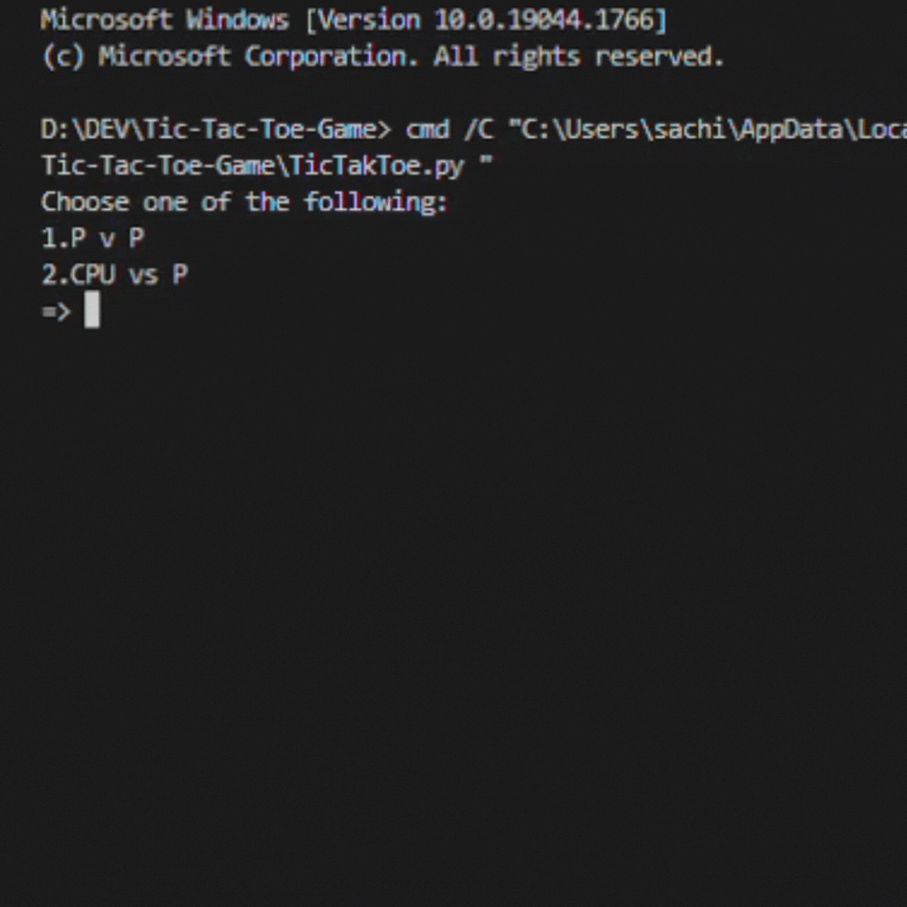

# Tic-Tac-Toe-Game
=> A tic tac toe game in Python with two modes. 
- AI vs P
- PvP

## Preview


## AI
- It uses Minimax Algorithm with Alpha-Beta Pruning to predict its move.
- It returns the most favourable position according to the board
    
## Installation

```
$ git clone https://github.com/thunderbolt181/Tic-Tac-Toe-Game.git
$ cd Tic-Tac-Toe-Game
$ python TicTakToe.py
```

**This code is like an api. You can use specific functions for specific things**<br/>
**Make sure to set `self.game` attribute to your board before using any of these functions**
- pvp(player, row, column) => it make a move by taking 'player', 'row' and 'column' as parameters and returns the following:
    - output string => It prints the current state of the game, It will be empty in case of no output
    - loop => Its is a boolean output stating if the game is ended or not.
    - player => It state which player should make the next move.
- AI() => it returns 'row' and 'column' number at which AI wants to make its move.
- check_win() => Checks if game has been finished by a win or not.
- check_tie() => Checks if game has been finished by a tie.
- check_pos(row, column) => Checks if given position is empty or not by taking 'row' and 'column' as parameters.

**For working Example You can refer to {if __name__=="__main__":} block in the code.**

**Player 1 is 'X' and denoted by `int(1)`.<br/> 
Player 2 is 'O' and denoted by `int(-1)`.<br/> 
Empty space is denoted by `int(0)`.<br/>
And is case of AI, AI is always Player 2 i.e. "O"**
